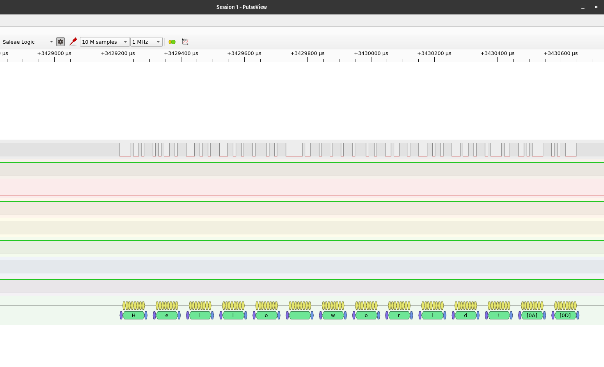

# guitar-tuner

A guitar tuner using an MSP430F5529 development board and an MAX4466 microphone amplifier module.

The goal is to create a guitar tuner with a custom 3D printed enclosure to gift to my girlfriend on her birthday.

## Learning Outcomes
- Protoboard soldering
- Audio signal processing
- Implementation of FFT
- Debugging with UART
- Basic 3D modeling

## Hardware
- MSP430F5529
- MAX4466
- Logic analyzer (if you're me, for debugging)
- Breadboard (for prototype)
- Protoboard (for "completed" version)
- Jumper wire, resistors, LEDs
- AA battery holder
- A switch
- Soldering equipment

### MSP430F5529 Launchpad

## Breakdown
- The MAX4466 microphone module inputs an analog signal into the MSP430
- The MSP430's Analog-to-Digital Converter converts the analog signal into a digital one (quite literally) and stores sample data in an array
- A Fast Fourier Transform (FFT) library written from scratch processes the data to determine the dominant frequency
- LEDs are used to keep track of which guitar strings have been tuned, as well as if the current string is too flat or too sharp

## Debugging over UART
Getting everything working in one go is impossible for anyone at my level of study. I am debugging with a logic analyzer using PulseView to view the sent characters/strings/ints over UART.

### PulseView settings

- 8 data bits, no parity, 1 stop bit
